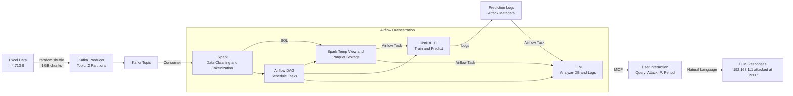

```mermaid
flowchart LR
    A[Excel Data<br>4.71GB] -->|random.shuffle<br>1GB chunks| B[Kafka Producer<br>Topic: 2 Partitions]
    B --> C[Kafka Topic]
    C -->|Consumer| D[Spark<br>Data Cleaning and Tokenization]
    D -->|SQL| E[Spark Temp View and Parquet Storage]
    E -->|Airflow Task| F[DistilBERT<br>Train and Predict]
    F -->|Logs| G[Prediction Logs<br>Attack Metadata]
    E -->|Airflow Task| H[LLM<br>Analyze DB and Logs]
    G -->|Airflow Task| H
    H -->|MCP| I[User Interaction<br>Query: Attack IP, Period]
    I -->|Natural Language| J[LLM Responses<br>'192.168.1.1 attacked at 09:00']

    subgraph Airflow Orchestration
        D --> K[Airflow DAG<br>Schedule Tasks]
        K --> E
        K --> F
        K --> H
    end
```